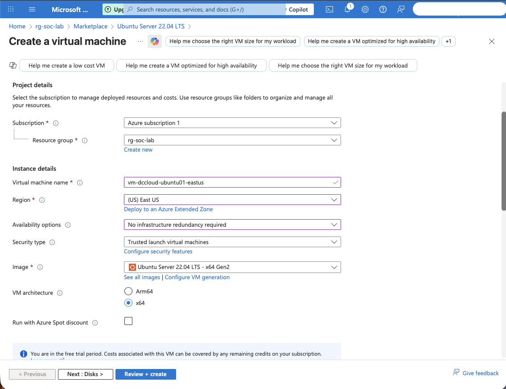
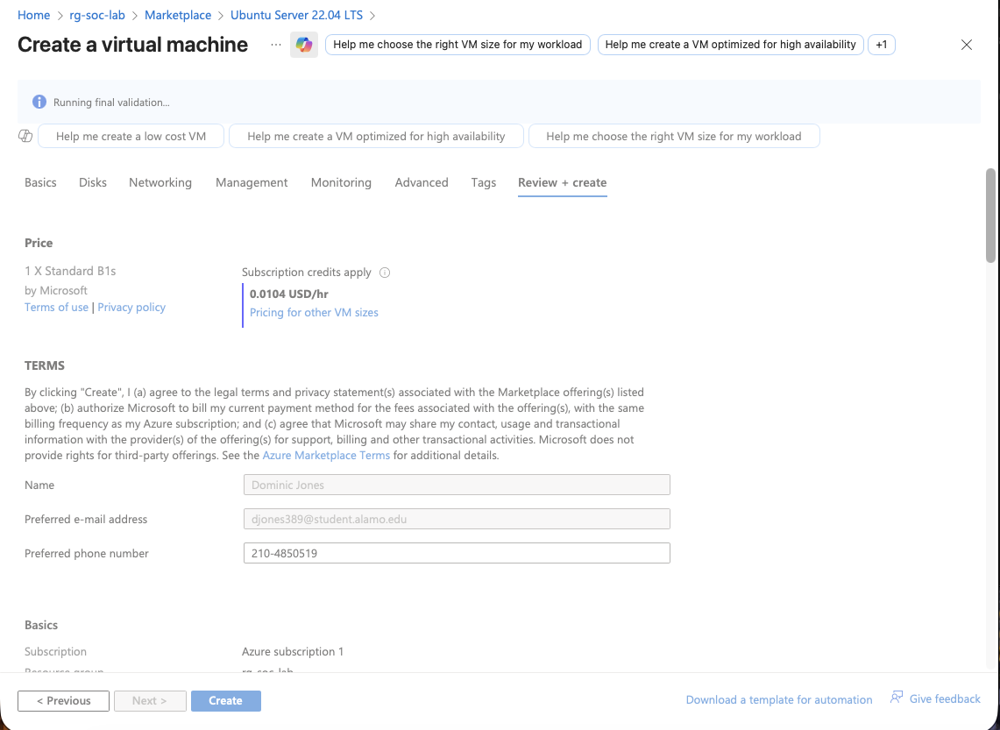
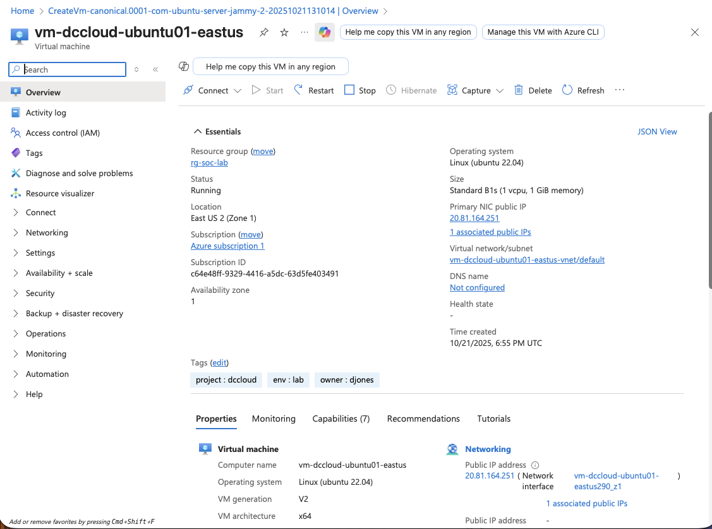

# 🧠 DaCyborg Cloud Lab — Azure SOC VM Project

**Author:** Dominic "DJ" Jones  
**Date:** October 2025  
**Platform:** Microsoft Azure  
**Region:** East US  
**Repository:** [dacyborg87/dccloud-lab](https://github.com/dacyborg87/dccloud-lab)

---

## 🧩 Project Overview
This is my first hands-on Azure project, where I deployed a secure Ubuntu 22.04 LTS virtual machine as part of my cybersecurity home lab.  
The VM will serve as the foundation for future integrations with Azure Sentinel, Wazuh SIEM, and Suricata IDS.

---

## ☁️ Azure Deployment Details

| Setting | Value |
|----------|-------|
| **Resource Group** | rg-soc-lab |
| **VM Name** | vm-dccloud-ubuntu01-eastus |
| **Region** | East US |
| **Image** | Ubuntu Server 22.04 LTS - x64 Gen2 |
| **VM Size** | Standard B1s (1 vCPU, 1 GiB RAM) |
| **Authentication** | SSH Public Key |
| **OS Disk** | Standard SSD (30 GiB) |
| **Tags** | project: dccloud, env: lab, owner: djones |

---

## 🔒 Security Configuration
After deployment:
1. Enabled **UFW Firewall**
2. Installed and configured **Fail2ban**
3. Set timezone to **America/Chicago**
4. Disabled password-based SSH login
5. Verified public IP accessibility via terminal

---

## 🧰 Tools Installed
- `ufw`
- `fail2ban`
- `net-tools`
- `curl`
- `vim`
- `htop`
- (Upcoming) `wazuh-agent`, `suricata`

---

## 🖼️ Deployment Screenshots
| Step | Screenshot |
|------|-------------|
| VM Creation |  |
| Review + Create |  |
| Running VM Overview |  |

---

## 🚀 Next Phase Goals
- Connect VM to **Azure Sentinel** workspace
- Install **Wazuh Agent** for log forwarding
- Configure **Sysmon** + custom alert rules
- Simulate brute-force attack for detection testing
- Automate setup with **Bash/CLI scripts**

---

## 💡 Key Takeaways
- Learned how to provision and secure a VM in Azure
- Practiced least-privilege and defense-in-depth principles
- Gained experience with cloud resource management
- Improved GitHub documentation skills for cybersecurity projects

